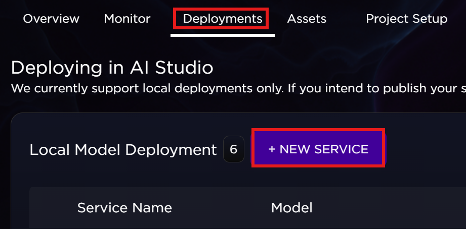
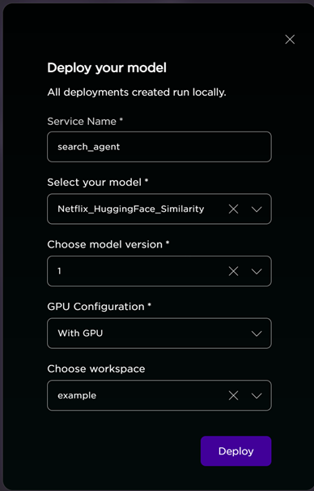

# Netflix Content Recommendation with MLflow

## Overview

This project demonstrates how to build, deploy, and interact with a machine learning model using MLflow. It provides recommendations for Netflix content based on user queries.

Key features:
- A Python model that finds Netflix content using semantic similarity
- MLflow for model packaging and deployment
- Simple HTML interface for users to interact with the model


## Prerequisites

- Python 3.7+
- MLflow
- PyTorch and Transformers
- Basic understanding of HTML and JavaScript

## Installation XXXXXXXXXXX

```bash
# Clone the repository 
https://github.com/brickj/examples.git

# Install dependencies
pip install mlflow pandas numpy scikit-learn torch transformers
```

## Project Structure

```
recommendation-app/
├── data/
│   ├── netflix_reviews.csv     # Netflix dataset
│   ├── embedded.csv            # Pre-computed embeddings
├── demo/
│   ├── index.html              # Web UI for the model
├── 03_deployment.py            # Main deployment script
├── README.md                   # This file
```

## How It Works

### 1. Model Creation and Deployment

We create a custom MLflow model that can find similar Netflix content based on a text query:

```python
class NetflixSimilarityModel(mlflow.pyfunc.PythonModel):
    def load_context(self, context):
        # Load necessary data and models when deployed
        self.embeddings_df = pd.read_csv(context.artifacts['embeddings_path'])
        self.netflix_df = pd.read_csv(context.artifacts['netflix_reviews_path'])
        self.tokenizer = AutoTokenizer.from_pretrained(self.model_name)
        self.model = AutoModel.from_pretrained(self.model_name)
    
    def predict(self, context, model_input, params):
        # Extract the query from input
        query = model_input["query"][0]
        
        # Process the query and find similar content
        # ...

        # Return formatted results
        return {"predictions": predictions}
```

The deployment script logs this model to MLflow, making it available for serving:

```python
# Register the model with MLflow
NetflixSimilarityModel.log_model(
    model_name="Netflix_HuggingFace_Similarity",
    embeddings_path="data/embedded.csv",
    netflix_reviews_path="data/netflix_reviews.csv",
    demo_dir="demo"  # Include the HTML interface
)
```

### 2. How the UI Communicates with the Model

The HTML interface sends requests to the model endpoint and displays the results. Here are the key parts:

#### Sending Data to the Model

When a user enters a query and clicks search, the UI sends a POST request to the model:

```javascript
// When the search button is clicked
$("#search").click(function() {
    var query = $("#query").val();
    if (!query) {
        alert("Please enter a search query");
        return;
    }
    
    $("#results").html('<div class="loading">Searching Netflix content...</div>');
    
    // Prepare the data to send to the model
    var payload = {
        inputs: { query: [query] },    // The user's search query
        params: { show_score: true, top_n: 5 }  // Additional parameters
    };
    
    // Send the request to the model endpoint
    $.ajax({
        url: window.location.origin + "/invocations",  // MLflow model endpoint
        type: "POST",
        contentType: "application/json",
        data: JSON.stringify(payload),
        success: function(response) {
            // Handle successful response (see next snippet)
        },
        error: function(xhr, status, error) {
            // Handle errors
        }
    });
});
```

#### Processing the Model's Response

When the model returns results, the UI processes and displays them:

```javascript
success: function(response) {
    $("#results").empty();
    
    // Extract predictions from the response
    var predictions = [];
    
    // Handle different response structures
    if (response.predictions && response.predictions.predictions) {
        predictions = response.predictions.predictions;
    } else if (response.predictions && Array.isArray(response.predictions)) {
        predictions = response.predictions;
    }
    
    // Display each recommendation
    if (predictions && predictions.length > 0) {
        predictions.forEach(function(item) {
            // Extract title from content
            var content = item.Content || "Unknown Content";
            var titleMatch = content.match(/^(.*?)\s*[\(:|]/);
            var title = titleMatch ? titleMatch[1].trim() : "Netflix Content";
            
            // Add result to the page
            $("#results").append(`
                <div class="result">
                    <h3 class="content-title">${title}</h3>
                    <p>${content}</p>
                </div>
            `);
        });
    } else {
        // No results found
        $("#results").html(`
            <div class="result">
                <h3>No results found</h3>
                <p>The model did not return any predictions.</p>
            </div>
        `);
    }
}
```

## Data Flow

Below is the tutorial data flow diagram:


#### Overview 


Here's what happens when you use the application:

1. **User Input**: You type a query like "action movies with superheroes" in the search box.

2. **Request Creation**: When you click Search, JavaScript creates a structured request object:
   ```javascript
   {
     "inputs": { 
       "query": ["action movies with superheroes"] 
     },
     "params": { 
       "show_score": true, 
       "top_n": 5 
     }
   }
   ```

3. **Sending to Model**: This request is sent to the "/invocations" endpoint where MLflow is serving the model.

4. **Model Processing**: The model:
   - Extracts your query text
   - Converts it to a numerical embedding (vector)
   - Compares it with pre-computed embeddings of Netflix content
   - Finds the most similar content
   - Formats the results

5. **Response Format**: The model returns a response like:
   ```javascript
   {
     "predictions": [
       {
         "Content": "The Avengers - Action: Superheroes team up to save the world",
         "Similarity": 0.89
       },
       {
         "Content": "Wonder Woman - Action: Amazon princess fights evil in World War I",
         "Similarity": 0.82
       },
       // More results...
     ]
   }
   ```

6. **Displaying Results**: The UI processes this response and displays each recommendation.

## Deploy in AI Studi XXXXXX

•	Execute the 03_deployment.py to set up the deployment
o	Select the “Deployments” tab
o	Click “Service”


  XXXXXXX


o	Fill out the Deployment information
o	Add a “Service Name”
o	Select the model
o	Choose the next highest model version
o	Select “With GPU” configuration
o	Choose your workspace
o	Click “Deploy”

  XXXXXXX


### 3. Interact with the model  XXXXXXXXXXX

Click the link at the top of the Swagger API page to access the UI

Try search queries like:
- "comedy"
- "action"
- "documentaries"


